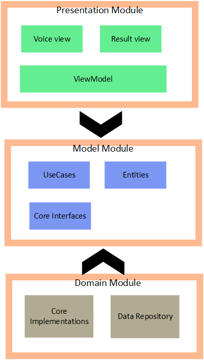
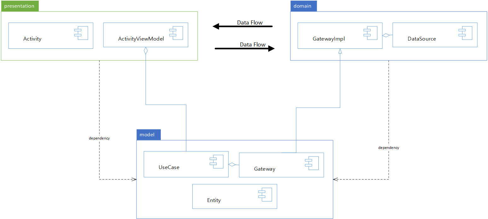
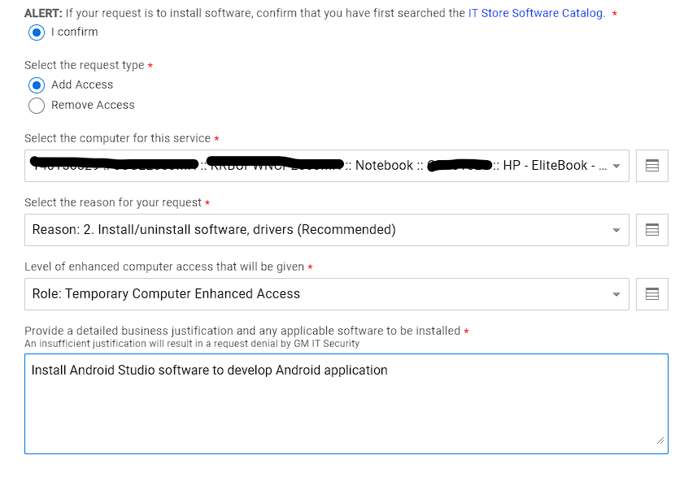

# '2025 GMAP Intern SW Project

## Project Overview

Design and implement Android application which works as the following :

- Take voice command text from Android SpeechRecognizer API([API Link](https://developer.android.com/reference/android/speech/SpeechRecognizer))
- Parse text and build protocol data with Protobuf API
- Send protocol to Androd Service(example. VehicleControlService) via AIDL API (optional)
- Make some actions on Android Service by a protocol (optional)
- Receive a result from Android Service and update a viewmodel and show a result. (optional)
- Make and build test cases for unit test with Mockk or Mockito.([Link](https://developer.android.com/training/testing/local-tests))
- Implement instrumented tests.([Link](https://developer.android.com/training/testing/instrumented-tests))
- Follow [Design Guideline](#design-guideline) section as much as you can.
- Change current gradle setting to [Version catalogs](https://developer.android.com/build/migrate-to-catalogs).

You can define any voice command you want to implement like examples belows :

- When speaking "Turn on the radio", show toggle buttons named as "Radio" to On.
- When speeking "음악 틀어줘", launch a music application.

You can implement more optionally below items :

- Control some functions in the other Android emulator via network operation.


## Design Guideline

#### Use Clean Architecture



> In other documents, the names are used as `UI`, `domain`, `data` to describe the Clean Architecture or MVVM design pattern but according to the GM's terminology, we will use names as `App`, `domain`, `data`.


You MUST design and implement the application with below technologies.

- Use Android Databinding
- Use Android Hilt for Dependency Injection
    >If you are familiar with other library such as Dagger2, you can use it instead of Hilt.
- Use Kotlin Flow to send/receive/collect a data with Kotlin coroutine.
    >If you are familiar with other technology like RxJava, you can use it.

The Application Must have 3 kinds of modules(`app`, `domain`, `data`).



##### App Module

This is built as `com.android.application` and contains belows
- Activity
- Fragment
- ViewModel

Activity is binding with layout XML by Android DataBinding.
Fragment is binding with layout XML by Android DataBinding.
ViewModel is injected into Activity or Fragment by Hilt.

ViewModel can have some usecase class in the Model module.

##### Domain Module

This is built as `java-library` and contains belows
- Entity
- Usecase
- Gateway(same as Repository)

##### Data Module

This is built as `com.android.library` and contains belows.
- Submodule which has Hilt `@Module` decorator
- Datasource like implementation of Gateway in the Model module
- Service
- Protobuf implementation
- Any other business logic implementation.

#### Use Feature branch on the GitHub


## Software development Environment

### Install software

### How to work on the GitHub

#### Prerequisite knowledge

- Understanding of basic git usages.
  - Making a branch.
  - Rebasing a branch.
  - Fixing a conflict.
  - Making a commit and pushing it.

#### Work flow

##### 1. create work branch

##### branch naming rule

`<prefix>`/`<branch name>`

###### prefix name

- feature
- fix

###### Example

`feature/make_service`
`fix/assert_servie`

##### 2. make a commit

##### 3. push a commit

##### 4. pull request

GitHub에 기본 application code를 공유할 예정.

### Reference

- [Dependency Injection and Android Hilt](https://developer.android.com/training/dependency-injection)

- [Android App Architecture](https://developer.android.com/topic/architecture)

- [Kotlin coroutines on Android](https://developer.android.com/kotlin/coroutines)

- [Kotlin flows on Android](https://developer.android.com/kotlin/flow)

- [GitBook](https://git-scm.com/book/en/v2)

## How to get `Computer Enhanced Access`

#### 1. go to [the site](https://it-store.gm.com/sm/ess/smOfferingPage?entityId=COMPUTERENHANCEDACCESSV2) in IT Store

#### 2. Fill the items as below.


#### 3. Click `CheckOut` button

#### 4. It would take a time about 1 day until process is done. Once the process is done, you can see a notification on your laptop.
Then, you can install software after reboot your laptop (Enhanced access would be available during 1 week)

### Trouble-Shooting

##### Can not connect GitHub server

Register git proxy as below.
```cmd
$car-control-sim> git config --global http.proxy http://koreaproxies.apa.gm.com:80
$car-control-sim> git config --global https.proxy http://koreaproxies.apa.gm.com:80
```
