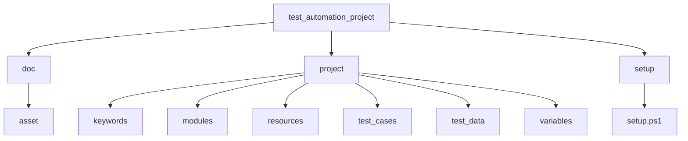

# Automation Project Instruction  

This ``readme.md`` file is for interns to help them understand the structure of automation projects so that they can create their own.  

## Directory Structure  

The structure you need to understand is shown below.  


- **doc**  
This directory can be used to store useful document files or assets that you need to use.  
    - asset  
    This should contain assets such as images, audio and video.  

- **setup**  
The script files that help set up the environment to run automation tests are located here, such as ``setup.ps1``, ``setup.bat``.   

- **project**  
This is the directory where your automation script should be located.
    - keywords  
    Keywords that you have created with the robotframework should be located in here.  
    The file extension that is located here can be ``.py`` or ``.resources``.  
    - modules  
    Pure Python code that can be used to create your own keyword should be located here, such as the until class, which contains many useful functions.  
    - resources  
    Various resources that are often used during testing can be placed here.  
    Images or various binary resources might be good.  
    - test_cases  
    The logic of the test case should be in here.
    The file extension that should be in here is ``.robot''.  
    - test_data  
    Any test data required during the execution of the test case should be stored here.  
    The ``.csv'' file format is required.  
    - variables  
    Variable file should be located here.  
    A variable file can contain a predefined value such as a ui id or a specific voice command that is used frequently.  
    The file extension that is located here can be ``.py`` or ``.variable``.  
     

## Scripting Instruction  

When writing automation code, there are a few practices to follow.  
Let's walk through the template code together.  

### Importing  

The import of each module must be done using an absolute path.  
Use your own ``AUTOMATION_HOME``.  

In the Python code, ``sys.path.append(os.environ.get('AUTOMATION_HOME'))`` code is needed so that this Python file can be called by the robot file.  
```python
import os
import sys
sys.path.append(os.environ.get('AUTOMATION_HOME'))
```
So you need to add the above code to your Python code.  
If the Python code doesn't need to be called by the robot file, then this process is not necessary.  

In the robot script, you can import the module as shown below.    
```robot
Resource     %{AUTOMATION_HOME}/project/keywords/open_setting_application.resource
```

### Naming  

#### Folder and File  

All folder and file names should be in lowercase letters.  
Spaces should be replaced with underscores.  
For example, ``sample test`` should become ``sample_test``.  

#### Variable and Function  

Variable and function names are also recommended to be lowercase, as are filenames.
```python
def join(self, *args):
    threading.Thread.join(self, *args)
    return self._return

frames = self._extract_gif_frames(self._answer_gif_path)
for frame in frames:
    if self._compare_image(masked, cv2.cvtColor(frame, cv2.COLOR_RGB2BGR)) > 0.5:
        return
```

#### Class  

Class names must follow the Camel Case convention.  
```python
class ValidationStepThread(threading.Thread):
    voice_chrome_rect: dict
    lock = threading.Lock()

    def __init__(self, **kwargs):    
        threading.Thread.__init__(self)
        ValidationStepThread.voice_chrome_rect = None
```

#### Keyword and Test Cases  

As with class names, they must follow the Camel Case rules.  
```robot
*** Keywords ***
Click Setting Main Menu
    [Arguments]    ${btn_name}
    Open Setting Application
    Wait Until Element Is Visible    android=UiScrollable(new UiSelector().scrollable(true).instance(0)).scrollIntoView(new UiSelector().text("${btn_name}").instance(0))
    Click Element    android=UiSelector().text("${btn_name}")
    Close Application
```

### Scripting  

Let's take a look at an important part of the template project's script.  

#### Variable  

The variables file looks like this.  
It doesn't have to be Python, it can be any ```.variable``` file.  
```python
import os
import sys
import platform
sys.path.append(os.environ.get('AUTOMATION_HOME'))

__all__ = [
    'appium', 
    'platform_name',
    'device_name',
    'automation_name',
    'chromedriver_executable',
    'package',
    'activity'
]

def get_chromedriver_path():
    pass

appium = {
    "ip": "127.0.0.1",
    "port": 4723,
    "base_path": "/wd/hub",
}

appium["url"] = f"http://{appium['ip']}:{appium['port']}{appium['base_path']}"

platform_name = "Android"

device_name = "emulator-5554"

automation_name = "Uiautomator2"

chromedriver_executable = get_chromedriver_path()
```
As you'll see, you can also use functions like ``get_chromedriver_path()`` to set variable values dynamically at the start of a test.  
And most importantly, in order for the variable to be used in the robot file, it needs to be added to the ``__all__`` array.


#### Keyword  

As you can see, the example keyword that opens the settings application is as follows.  
```robot
*** Settings ***
Library      AppiumLibrary
Library      Process
Variables    %{AUTOMATION_HOME}/project/variables/appium_setup.py
Variables    %{AUTOMATION_HOME}/project/variables/proxy.py
Variables    %{AUTOMATION_HOME}/project/variables/app_info.py

*** Keywords ***
Open Setting Application
    Open Application    ${appium}[url]        
    ...    platformName=${platform_name}        
    ...    deviceName=${device_name}   
    ...    automationName=${automation_name} 
    ...    appPackage=${package}[settings]
    ...    appActivity=${activity}[main]
    ...    chromedriverExecutable=${chromedriver_executable}
    ...    newCommandTimeout=3000
```
You can call value from Python variable files.  

#### Test Case  

The template test case is shown below.  
```robot
*** Settings ***
Library      AppiumLibrary
Resource     %{AUTOMATION_HOME}/project/keywords/open_setting_application.resource
Variables    %{AUTOMATION_HOME}/project/variables/data_loader.py    %{AUTOMATION_HOME}/project/test_data/click
 
 
*** Test Cases ***
Click Setting Main Menu Test
    [Tags]    feature:Click    sub-feature:Function Verification
    [Template]    Click Setting Main Menu
    FOR    ${ele}    IN    @{click_setting_main_menu}
        ${ele}[btn_name]
    END
 
 
*** Keywords ***
Click Setting Main Menu
    [Arguments]    ${btn_name}
    Open Setting Application
    Wait Until Element Is Visible    android=UiScrollable(new UiSelector().scrollable(true).instance(0)).scrollIntoView(new UiSelector().text("${btn_name}").instance(0))
    Click Element    android=UiSelector().text("${btn_name}")
    Close Application
```

##### Template Keyword  

The real test case logic must belong to the template keyword.   
In this case the template keyword is ``Click Setting Main Menu``.   
All the core logic of the test case is inside ``Click Setting Main Menu``.   
After you have implemented the template keyword, you need to link this keyword to the test cases with ``[Template]`` syntex.  

##### Naming  

The name of the test case must be in the format ```{Template Keyword Name} + Test``.  
For example, in the above test case, the template keyword name is ``Click Setting Main Menu``, so the test case name should be ``Click Setting Main Menu Test``.  

##### Tags  

Tags are mainly used to categorise the test case so that we can see the report more easily.  
The content of tags can vary depending on your project.  
But it is good to use prefix in each tag like ``feature:``, ``sub-feature:`` because the tag is internally ordered by Robotframework.  

##### Csv file integration  

In order to run the above example test case, ``.csv`` is required.  
There is a predefined Python variable file with a function in ``data_loader.py``.  
The file is shown below.  
```python
import os
import csv
import sys
sys.path.append(os.environ.get('AUTOMATION_HOME'))

def load_csv(data_dir):
    data = {}
    for (path, dir, files) in os.walk(data_dir):
        for filename in files:
            ext = os.path.splitext(filename)[-1]
            if ext == '.csv':
                data_list = []
                var_name = os.path.splitext(filename)[0]
                with open(f'{path}/{filename}', encoding='utf-8') as f:
                    reader = csv.DictReader(f)
                    for row in reader:
                        data_list.append(row)
                data[var_name] = data_list
    return data

def get_variables(data_dir, file_ext = "csv"):
    return globals()[f'load_{file_ext}'](data_dir)
```

You can simply call this in your ``.robot`` file as shown below.  
```robot
Variables    %{AUTOMATION_HOME}/project/variables/data_loader.py    %{AUTOMATION_HOME}/project/test_data/click
```
You need to pass the location of the directory containing the ``.csv`` file as an argument when you call this variable.  
Then ``data_loader.py`` will convert the ``.csv`` files in the target directory to the robot variable.  

Once you have imported this, you can run the code below.  
```robot
*** Test Cases ***
Click Setting Main Menu Test
    [Tags]    feature:Click    sub-feature:Function Verification
    [Template]    Click Setting Main Menu
    FOR    ${ele}    IN    @{click_setting_main_menu}
        ${ele}[btn_name]
    END
```
The data in the ``click_setting_main_menu.csv`` file is converted to the robot array variable ``@{click_setting_main_menu}``.  

So in this case the ``.csv`` file looks like this.  
```csv
btn_name
Apps
Vehicle
Connections
```
The content of the ``@{click_setting_main_menu}`` is the same as ``[ "Applications", "Vehicle", "Connections" ]``.  
One thing you need to know is that the ``btn_name`` is the column title, so you need to use variables like ```${ele}[btn_name]``` syntex.  

If the ``.csv`` file has many column titles like below, the way you can call the value is not that different.  
```csv
btn_name        sub_name
Apps            View All Apps
Vehicle         Vehicle Models
Connections     Wi-Fi
```

In this case, you can simply write the script as follows.  
```robot
FOR    ${ele}    IN    @{click_setting_main_menu}
    ${ele}[btn_name]    ${ele}[sub_name]
END
```

